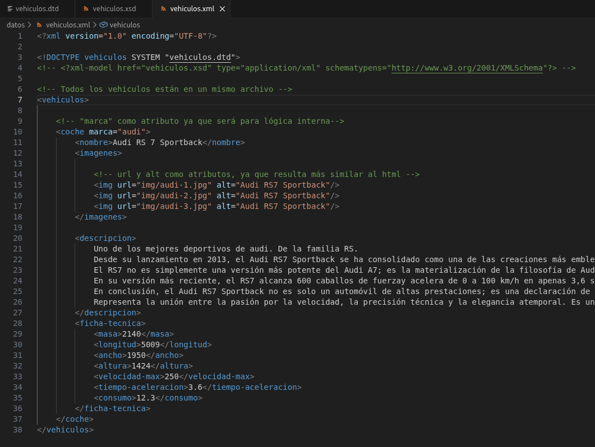
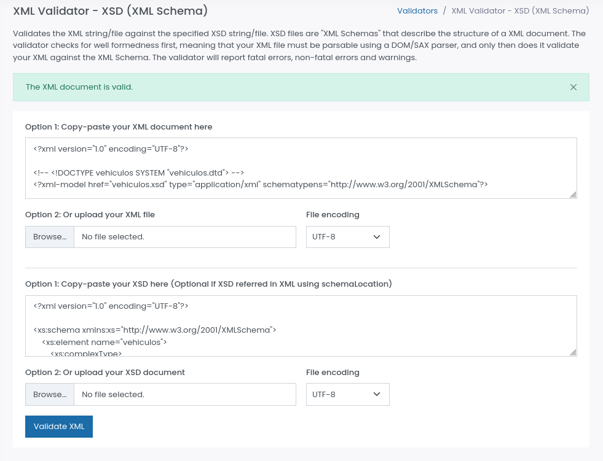

# Validación del archivo vehiculos.xml
## 1. Herramientas utilizadas
### Validación DTD
- Herramienta: XML Tools
- Versión: 2.5.1
### Validación XSD
- Herramienta: [Freeformater Validator](https://www.freeformatter.com/xml-validator-xsd.html)
## 2. Proceso de validación
### Validación contra DTD
- Descomentar el DOCTYPE enlazado al DTD
- Asegurarse de que XML Tools y XML (Red Hat) están activos
- Revisar si devuelve un error

## 3. Proceso de validación
### Validación contra XSD
**Comando/Pasos ejecutados:**
- Entrar en la web de Freeformater
- Pegar el código XML
- Pegar el código XSD
